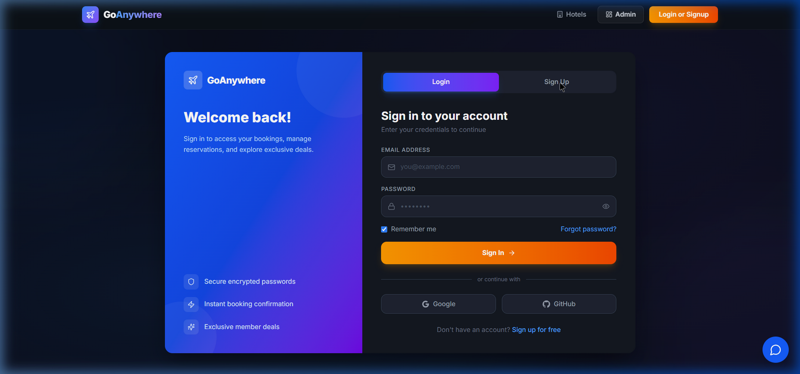
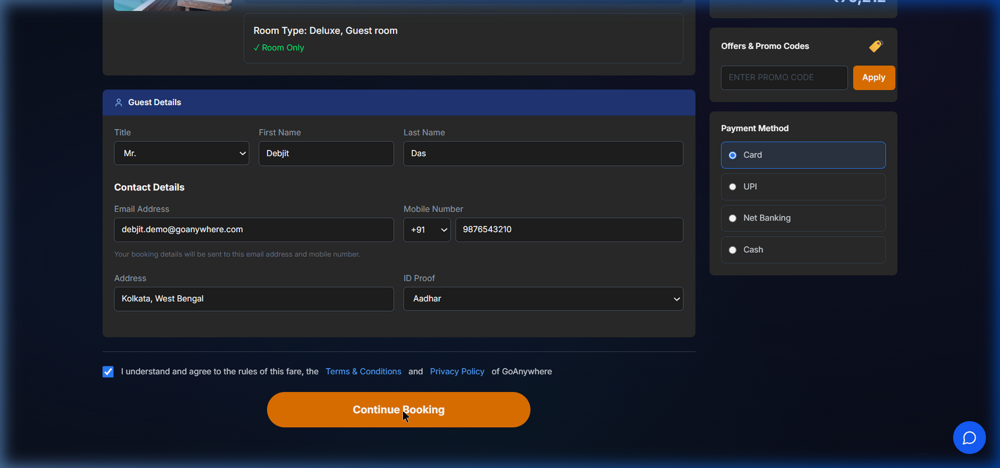
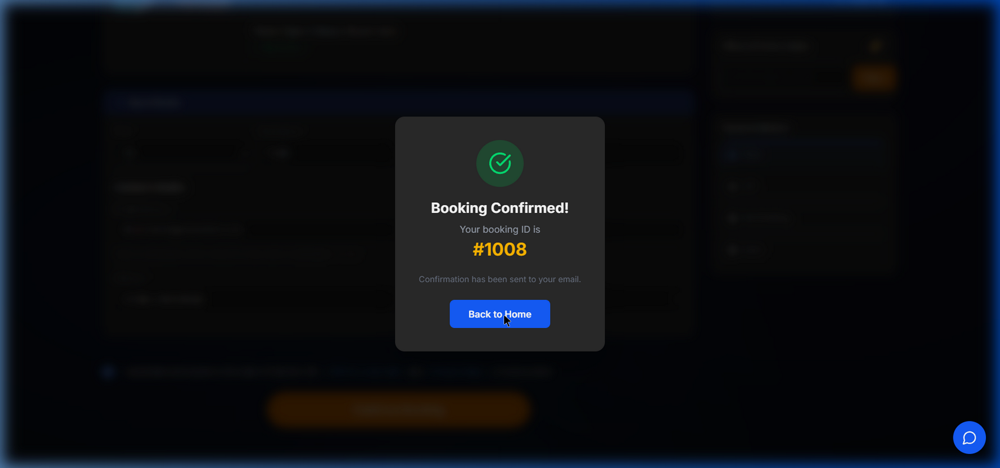
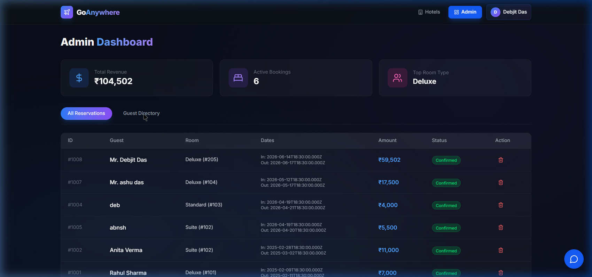

<p align="center">
  
</p>

<h1 align="center">🏨 GoAnywhere — Advanced Hotel Booking Platform</h1>

<p align="center">
  <em>A high-performance, full-stack hotel booking and management system built with <strong>Next.js 14</strong>, <strong>Tailwind CSS v4</strong>, and <strong>raw MySQL</strong>.</em>
</p>

<p align="center">
  
  
  
  
  
  
</p>

---

## 📽️ Live Demo Walkthrough

> Complete end-to-end flow: **User Signup → Hotel Search → Room Booking → Payment Confirmation → Admin Dashboard → Logout**

<p align="center">
  
</p>

---

## ✨ Key Features

### 🔐 Secure Authentication
- Custom **JWT-based** stateless authentication (no third-party auth providers)
- **bcrypt** password hashing for secure credential storage
- HTTP-only cookie session management
- Split-layout premium login/signup UI

### 🏨 Smart Hotel Search & Booking
- Real-time hotel search across **6 major Indian cities** (Mumbai, Chennai, Goa, Delhi, Jaipur, Udaipur)
- Dynamic room availability powered by **live MySQL queries**
- Multi-step checkout with guest details, payment method selection, and instant confirmation
- Automated booking ID generation via **MySQL triggers**

### 📊 Admin Dashboard
- Centralized reservation management with real-time statistics
- Revenue tracking, active bookings count, and top room-type analytics
- Guest directory with full CRUD operations
- ACID-compliant cancellation with automatic room status restoration

### 🎨 Premium Dark UI
- Meticulously crafted with **Tailwind CSS v4** and **glassmorphism** effects
- Animated mesh backgrounds, gradient hero sections, and micro-animations
- Fully responsive across desktop and mobile viewports
- Google Fonts (Inter) for professional typography

---

## 📸 Screenshots

<table>
  <tr>
    <td align="center"><strong>🔑 Signup Page</strong></td>
    <td align="center"><strong>📝 Booking Form</strong></td>
  </tr>
  <tr>
    <td></td>
    <td></td>
  </tr>
  <tr>
    <td align="center"><strong>✅ Booking Confirmation</strong></td>
    <td align="center"><strong>📊 Admin Dashboard</strong></td>
  </tr>
  <tr>
    <td></td>
    <td></td>
  </tr>
</table>

---

## 🛠️ Technology Stack

| Layer | Technology | Purpose |
|-------|-----------|---------|
| **Frontend** | React 18, Next.js 14, Tailwind CSS v4 | Server-side rendering, App Router, responsive UI |
| **Backend** | Next.js API Routes (Serverless) | RESTful endpoints, business logic |
| **Database** | MySQL 8.0 (raw `mysql2/promise`) | Relational data, ACID transactions, triggers |
| **Authentication** | `jose` (JWT), `bcryptjs` | Stateless sessions, encrypted passwords |
| **Icons** | Lucide React | Consistent iconography |
| **Deployment** | Vercel + TiDB Cloud (MySQL) | Zero-config CI/CD |

---

## 🗄️ Database Architecture (DBMS)

This project demonstrates advanced relational database concepts required for the DBMS curriculum:

### Entity-Relationship Model
```
Hotel (1:N) ──→ Room (N:1) ──→ Reservation (1:1) ──→ Payment
                                    ↑
                              Guest (1:N)
                                    ↓
                            Booking_Services (N:M) ──→ Service
```

### Core Tables
| Table | Description |
|-------|------------|
| `Hotel` | Hotel properties with name, location, contact, and rating |
| `Room` | Room inventory with type, pricing, and availability status |
| `Guest` | Customer records with contact info and ID proof |
| `Reservation` | Booking records linking guests to rooms with check-in/out dates |
| `Payment` | Payment transactions with method and status tracking |
| `Staff` | Hotel staff records with roles, salary, and shift details |
| `Service` | Additional services (spa, dining, laundry) |
| `Booking_Services` | Many-to-many junction table for booking-service mapping |
| `User` | Authentication table (auto-created on app startup) |

### Advanced SQL Features Implemented
- **Triggers** — Automatic room status updates on booking/cancellation
- **Stored Procedures** — Encapsulated booking logic
- **Transactions** — ACID-compliant multi-table insertions with rollback
- **Views** — Aggregated reporting for admin dashboard
- **Joins** — Complex multi-table queries for search and analytics
- **Indexing** — Optimized query performance on frequently accessed columns

---

## 💻 Getting Started

### Prerequisites
- **Node.js** 18+ and **npm**
- **MySQL** 8.0+ (local or cloud)

### 1. Clone & Install

```bash
git clone https://github.com/yourusername/DBMS-hotel-booking.git
cd DBMS-hotel-booking
npm install
```

### 2. Configure Environment

Create a `.env.local` file in the root directory:

```env
MYSQL_HOST=localhost
MYSQL_USER=root
MYSQL_PASSWORD=your_password
MYSQL_DB=Hotel_Management_System
JWT_SECRET=your_secure_random_string_here
```

### 3. Initialize Database

Execute the SQL files in order against your MySQL instance:

```bash
mysql -u root -p < 1_schema.sql
mysql -u root -p Hotel_Management_System < 2_data.sql
mysql -u root -p Hotel_Management_System < 3_triggers.sql
mysql -u root -p Hotel_Management_System < 4_procedures.sql
mysql -u root -p Hotel_Management_System < 5_views.sql
```

> **Note:** The `User` table for authentication is auto-created when the app starts.

### 4. Seed Additional Hotels (Optional)

```bash
node seed_destinations.js
```

### 5. Run Development Server

```bash
npm run dev
```

Navigate to [http://localhost:3000](http://localhost:3000) to view the application.

---

## 📁 Project Structure

```
DBMS-hotel-booking/
├── src/
│   ├── app/
│   │   ├── page.tsx              # Homepage with hero, search, destinations
│   │   ├── login/page.tsx        # Authentication (Login/Signup)
│   │   ├── search/page.tsx       # Hotel search results
│   │   ├── hotel/[hotelId]/      # Hotel detail with gallery & rooms
│   │   ├── book/page.tsx         # Multi-step booking checkout
│   │   ├── admin/page.tsx        # Admin dashboard
│   │   └── api/
│   │       ├── auth/             # Login, Signup, Me, Logout
│   │       ├── search/           # Hotel search endpoint
│   │       ├── rooms/            # Room availability
│   │       ├── book/             # Booking creation (transactional)
│   │       ├── chatbot/          # AI-powered chatbot
│   │       └── admin/            # Stats, reservations, guests CRUD
│   ├── components/
│   │   ├── Navigation.tsx        # Auth-aware navbar with user dropdown
│   │   ├── Footer.tsx            # Site footer
│   │   └── Chatbot.tsx           # Floating AI chatbot
│   └── lib/
│       └── db.ts                 # MySQL connection pool & User table init
├── 1_schema.sql                  # Database schema
├── 2_data.sql                    # Sample data
├── 3_triggers.sql                # Automated triggers
├── 4_procedures.sql              # Stored procedures
├── 5_views.sql                   # Database views
├── 6_transactions.sql            # Transaction examples
└── seed_destinations.js          # Hotel seeding script
```

---

## 🚀 Deployment (Vercel)

1. Push code to GitHub
2. Import project into [Vercel](https://vercel.com)
3. Set up a cloud MySQL instance (e.g., [TiDB Cloud Serverless](https://tidbcloud.com) — free tier)
4. Configure environment variables in Vercel dashboard:
   - `MYSQL_HOST`, `MYSQL_USER`, `MYSQL_PASSWORD`, `MYSQL_DB`, `JWT_SECRET`
5. Deploy — Vercel handles the rest automatically

---

## 👨‍💻 Author

**Debjit Das**
**Anshumaan Das**
---

<p align="center">
  <em>Developed with 💡 for academic excellence and modern web standards.</em>
</p>
